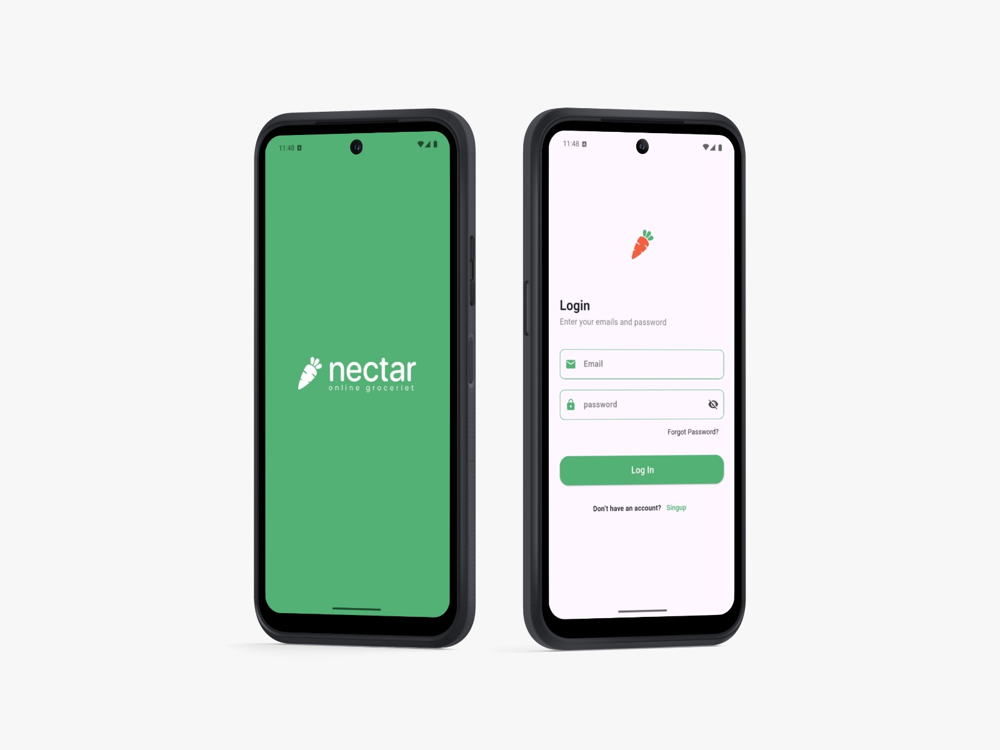

# Merged README

## Old README Content

# 🥕 Nectar App (Flutter)

A modern Flutter-based mobile application designed for grocery shopping.  
It provides a smooth user experience with authentication, location selection, and a clean UI design.

---

## 📌 Features

- 🖼️ **Splash Screen** with app logo  
- 🔐 **Authentication System**  
  - Login with email & password validation  
  - Signup with username, email, and password validation  
- 📍 **Location Selection** from a predefined list of cities  
- 🎨 **Reusable Widgets** for buttons, text fields, and password inputs  
- ✨ Custom styling with colors, text styles, and SVG assets  

---

## 🔧 Technologies Used

- **Flutter** (Dart)  
- **Material Design**  
- **SVG Support** via `flutter_svg`  
- **Form Validation** with custom validators  

---

## 🚀 How to Run

1. Clone the repository:
   ```bash
   git clone https://github.com/your-username/nectar.git
   ```
2. Navigate to the project directory:
   ```bash
   cd nectar
   ```
3. Get dependencies:
   ```bash
   flutter pub get
   ```
4. Run the app:
   ```bash
   flutter run
   ```

---

## 📂 Project Structure

```
lib/
├── core/
│   ├── constants/        # App images
│   ├── functions/        # Validators & navigation helpers
│   ├── text/             # Text styles
│   ├── util/             # Colors
│   └── widgets/          # Reusable widgets
├── features/
│   ├── splash/           # Splash screen
│   └── auth/             # Login, Signup, Location screens
└── main.dart             # Entry point
```

---

## 🖼️ Screenshots  

| Splash & Login | Signup & Location |
|----------------|-------------------|
|  |  |

---

 


---

## Updated README Content

# 🛒 Nectar App

A Flutter-based grocery shopping application with a clean and modern UI.  
The app demonstrates **state management, navigation, custom widgets, and responsive layouts**.  

---

## 📂 Project Structure

```
lib/
│
├── core/
│   ├── constants/      # App constants (e.g., images, strings)
│   ├── text/           # Text styles
│   ├── util/           # Utility files (colors, themes, helpers)
│   └── widgets/        # Reusable custom widgets
│
├── features/
│   ├── account/        # Account screen and related pages
│   ├── cart/           # Shopping cart screens & widgets
│   ├── explore/        # Explore products categories
│   ├── favorite/       # Favorite products screen
│   └── home/           # Home page, product cards, builders
│
└── main.dart           # Entry point
```

---

## ⚙️ Setup

1. Clone the repository
   ```bash
   git clone <repo-url>
   cd nectar
   ```

2. Get dependencies
   ```bash
   flutter pub get
   ```

3. Run the project
   ```bash
   flutter run
   ```

---

## 📱 Features

- **Authentication Screens**  
  - Login & Register  
  - Onboarding  

- **UI Essentials**  
  - Custom text fields  
  - Reusable buttons  
  - Centralized theme & colors  

---

## 🚀 New Features (Latest Update)

- **Main Screen**  
  - Bottom Navigation Bar for seamless navigation between pages.  

- **Home Screen**  
  - *Exclusive Offer Section* with horizontal list.  
  - *Best Selling Section* with grid view.  

- **Explore Screen**  
  - Categories grid (Fruits, Oil, Meat, Bakery, Dairy, Beverages, etc.).  

- **Favorite Screen**  
  - Displays saved products.  
  - "Add All To Cart" button.  

- **Cart Screen**  
  - Add/Remove product quantity.  
  - Auto price calculation.  

- **Account Screen**  
  - User profile with avatar, name, email.  
  - Orders history.  
  - My Details.  
  - Delivery Address.  
  - Payment Methods.  
  - Promo Code.  
  - Notifications.  
  - Help section.  
  - About app.  
  - Logout option.  

---

## 📸 Screenshots


---

## 🛠️ Tech Stack

- **Flutter** (Dart)  
- **Material Design**  
- **State Management**: setState (basic)  

---

## 👨‍💻 Author

Built with ❤️ by **Moataz Mahmoud**  

- [LinkedIn](https://www.linkedin.com/in/moataz-mahmoud-a2a548a6/)  
- [Codeforces](https://codeforces.com/profile/El-Gazzar) 
